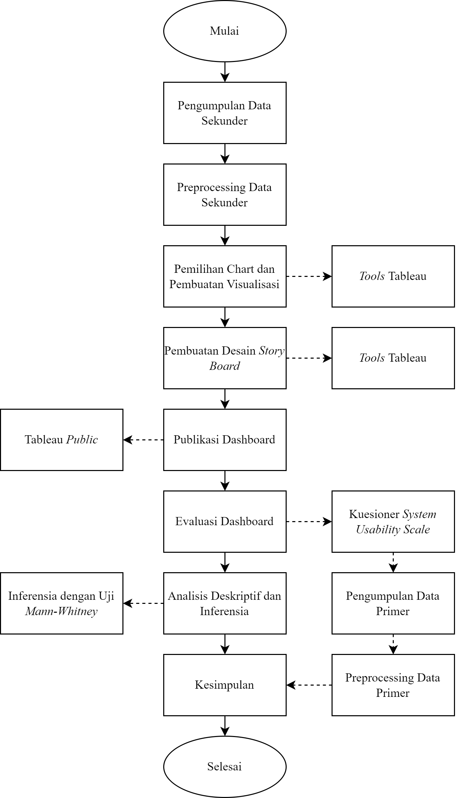

# Visualisasi Interaktif Potret Provinsi Jawa Barat dalam SDGs
Repository ini sebagai dokumentasi resmi dari project visualisasi UAS Mata Kuliah Visualisasi Data dan Informasi yang hasilnya dapat diakses melalui tautan [berikut](https://public.tableau.com/app/profile/rafif.hasabi/viz/VisualisasiInteraktifPotretSDGs4ProvinsiJawaBarat/VisualisasiInteraktifPotretProvinsiJawaBaratdalamSDGs4). 

## Abstrak

Pendidikan merupakan tujuan keempat dalam Sustainable Development Goals (SDGs) yaitu mendorong pendidikan yang berkualitas, inklusif, setara, dan mendukung kesempatan belajar bagi setiap orang. Data pendidikan yang tersebar dan dari berbagai tahun membuat sulitnya mendapatkan akses data pendidikan secara keseluruhan. Selain itu data yang ada masih berupa tabel sehingga audiens data membutuhkan waktu untuk memahami data tersebut. Data pendidikan diperoleh dari website Badan Pusat Statistik dan Open Data Provinsi Jawa Barat. Penelitian ini berusaha mengimplementasikan visualisasi interaktif terkait potret Provinsi Jawa Barat dalam SDGs keempat untuk menyatukan data pendidikan yang beragam menjadi satu tempat berbentuk story board dan dilakukan evaluasi menggunakan kuesioner system usability scale. Penelitian ini menghasilkan visualisasi interaktif yang menarik serta dari hasil evaluasi diperoleh skor 81.5 yang dapat dikategorikan Excellent. Dari hasil uji Mann-Whitney diperoleh bahwa tidak terdapat perbedaan persepsi penilaian antara kalangan lingkup pendidikan dan kalangan masyarakat umum.

## Tujuan

>📋 Mengimplementasikan visualisasi data interaktif menggunakan Tableau terkait data pendidikan di Provinsi Jawa Barat dalam satu Story Board yang menarik.

>📋 Mengevaluasi visualisasi data interaktif yang telah dibuat berdasarkan persepsi penilaian oleh dua kelompok pengguna.

## Pengumpulan Data

>📋 Data terdiri dari data primer dan sekunder.

- Data primer dari hasil pengisian kuesioner System Usability Scale (SUS) untuk evaluasi visualisasi interaktif data pendidikan Provinsi Jawa Barat.
- Data dari website [Badan Pusat Statistik Provinsi Jawa Barat](https://jabar.bps.go.id/) seperti Indeks Pembangunan Manusia (IPM), Indeks Pendidikan, Angka Melek Huruf (AMH), Angka Partisipasi Murni (APM), Jumlah Sekolah, dan Rasio Guru dengan Murid.
- Data yang dari website [Open Data Provinsi Jawa Barat](https://opendata.jabarprov.go.id/id) adalah Ketersediaan Fasilitas Pendidikan.
- Data dari website [Indonesia Geospatial Portal](https://tanahair.indonesia.go.id/) yaitu data shape file batas administrasi Provinsi Jawa Barat.

## Alat yang Digunakan

1. Microsoft Excel untuk organisasi raw data hasil kuesioner SUS dan data visualisasi
2. Tableau Versi 2022.4 untuk membuat visualisasi interaktif berbentuk *story board*
3. IBM SPSS Statistics Versi 26 untuk melakukan uji *Mann-Whitney*

## Alur Penelitian

>📋  Give a link to where/how the pretrained models can be downloaded and how they were trained (if applicable).  Alternatively you can have an additional column in your results table with a link to the models.

## Hasil

Our model achieves the following performance on :

### [Image Classification on ImageNet](https://paperswithcode.com/sota/image-classification-on-imagenet)

| Model name         | Top 1 Accuracy  | Top 5 Accuracy |
| ------------------ |---------------- | -------------- |
| My awesome model   |     85%         |      95%       |

>📋  Include a table of results from your paper, and link back to the leaderboard for clarity and context. If your main result is a figure, include that figure and link to the command or notebook to reproduce it. 
